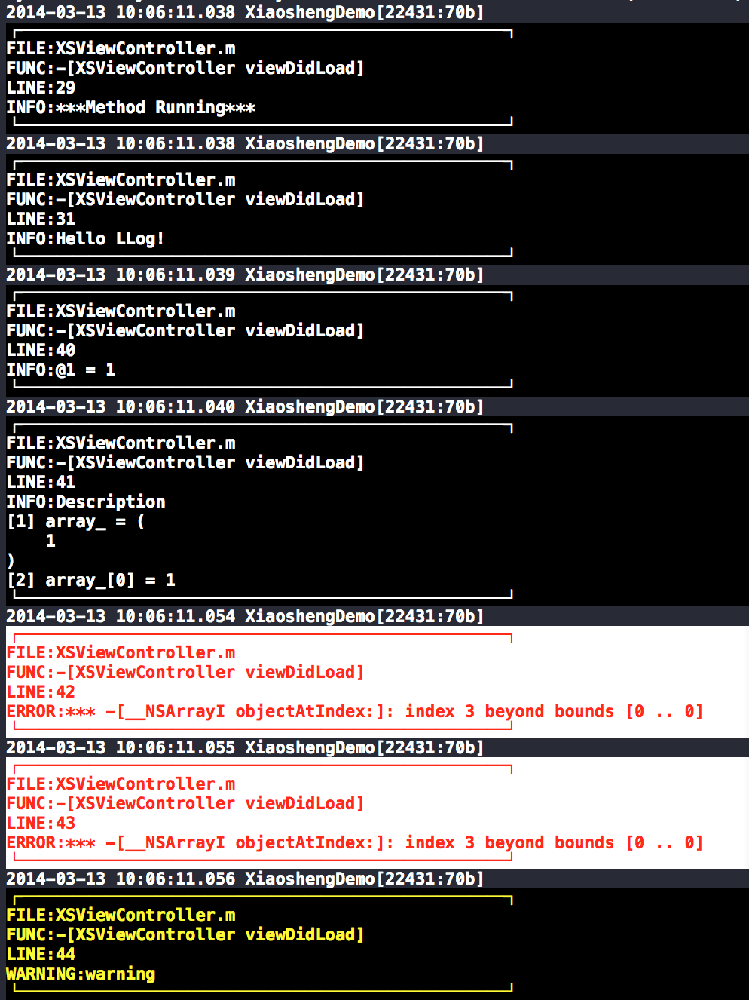

LLog
====

LLog is a replacement of NSLog. It has the same format and syntax as NSLog, but more powerful. It can output more detailed infomation, like filename, method name, line number and object value, with nice format.

## Screenshot



## Requirements

- Xcode plugin [XcodeColors](https://github.com/robbiehanson/XcodeColors)


## How to

### Usage

Common usage

```
LLog(@"Hello %s%s", "LLog", "!");

LOLog(@1);

LOLog2(@"Description", array_, array_[0]);

```

Log Error or Exception

```
LLoge(@"%@", exception);

LELog(exception);

```

Log Warning

```
LLogw(@"%@", @"warning");

LWLog(@"warning");

```

### Custom color scheme


You can use your prefered color scheme by change the value of each macro.

```
#define _LLog_INFO_FG               "fg255,255,255;"
#define _LLog_INFO_BG               "bg0,0,0;"

#define _LLog_WARN_FG               "fg255,255,0;"
#define _LLog_WARN_BG               "bg0,0,0;"

#define _LLog_ERROR_FG              "fg255,0,0;"
#define _LLog_ERROR_BG              "bg255,255,255;"
```


### Turn off log

You can turn off log by change the value of `_LLog_SWITCH` to `0`, when you release your app.

```
#define _LLog_SWITCH 0

```

## Warning

**LLog will slow down the performance of app，so you should always turn off it when you release your app, or you want to see the real performance of your app, and for security reason.**

## Licence

- See [LICENCE](https://github.com/srvz/LLog/blob/master/LICENSE)
